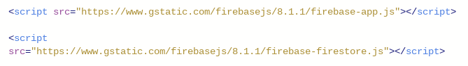

# Entry 2
##### 11/30/20

In this point of time, I should be ready to start planning out my project.
As for the websites I have been using, I've been on [Repl](https://repl.it/@SamLee5/Testing-FireStore#index.html) for testing my tool,
[Firebase](https://firebase.google.com/).

My stage in the Engineering Design Process is probably stage 4, which is to **plan the most promising solution**.
I've already thought of the possible solutions to my problem of unorganization. Obviously I wanted something more efficient
and something that won't take a lot of time to use. I've narrowed my way to down the idea that this app allows you to press
things on screen and the user will just need to fill in necessary information (i.e. Page numbers or amount of minutes needed to read).

The tool that I've been focusing on is Firebase and I will continue to use this tool. Specifically I've been using its [FireStore](https://firebase.google.com/products/firestore)
feature. This is probably the key feature of the tool that helps me store and retrieve data. In addition, my project that I'm working on is a
homework and assignment tracker that is efficient because it allows quick user input that would automatically be placed into a list
as a reminder.

In terms of skills, I've learned how to **embrace failure** and **debugging** when tinkering with my tool. Initially when I tried to
install Firebase into my Web App, I went through some errors. Although I was pretty new with the tool, just by looking at the code,
I realized that I had installed an older version of the database. I simply debugged this by switching from a Realtime-Database into the new
Cloud Firestore.

[Previous](entry01.md) | [Next](entry03.md)

[Home](../README.md)