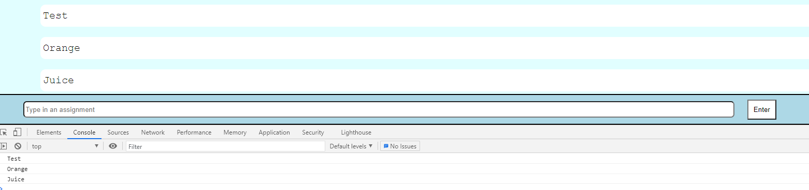

# Entry 4
##### 4/26/21

Through the course of this entry, I will go through the process of creating the DOM portion of my Freedom Project. As my project is based on saving/documenting assignments that the user is needing to keep track of, I needed to make the application able to process the user's input and display it in a nice "list" format. In addition, I've done more Firestore testing which could potentially be added into my application.

Here is the **timeline** that focuses on what I did this week.

Throughout this project, I've done my testing on my demo-website which is [here](https://ide-28ce95ffd3744292bda1b0e1ac9b55a5-8081.cs50.ws/index.html) for reference. My testing done with Firebase will be located [here](https://replit.com/@SamLee5/Testing-FireStore#script.js). Some addition sources I've used as reference were firebase's [documentation](https://firebase.google.com/docs/firestore/manage-data/add-data) on adding data and a simple [keycode grabber](https://keycode.info/)

At this point of time, I'm at the **create a prototype** stage of the Engineering Design Process. I've been working on the HTML portion and the DOM portion of my web application in the previous weeks. I've been able to add some CSS to make my web application a little more pleasing to the eye. In this entry, I will be going over the DOM that I have added as well as some additional Firebase tinkering that will be soon added to my demo-website. In the coming weeks, I'll be soon finishing adding aspects of my tool, Firebase, into my application as well as testing my protocol and try to prevent any source of bugs and errors.

## DOM

As I was coding in script.js in my demo-website, I ran into an error. (Code Below)

The first three lines are there for the set-up. I've created three separate variables that grabbed using the `querySelector()` some HTML as well as the first variable that uses `createElement()` to make a list component. Then I continued on with the Button feature. How would I be able to make the application listen for an event? Well, it was obviously needing the `addEventListener` for `click`. Now the slight mistake that I had was actually a typo.

As you can see above, I've made a simple typo error because the names were mismatched. It's very common that these mistakes happen, and it's very possible that a whole program wouldn't work because of one typo. Obviously, it should be easy to fix, but I would like to emphasize that these errors are common and they do happen.

**Image of the Console**

From the image above, you can see that after pressing the "Enter" button on the page, the console picks up whatever what typed into the input.

Now, my thought process at this time was to basically ask myself, "How do I change this from the console to the actual webpage?" In addition, I asked myself, "Is there a way to automatically empty out the text box after sending it?"

Continuing on, I converted the anonymous function from the `addEventListener` into a separate function outside. What this allows me to do, is basically add the function into two separate events. One event for the button `click` itself, and one event for the `keypress` that allows something to happen when a key is pressed. In this case, I want the "Enter" on the keyboard to have the same function as the `click` event for the button. (Image Below For Reference)

The code is also modified so that the `li` innerHTML gets converted, thus making it appear on the page (instead of just console.log).

From the image below, I added to the function a very small piece of code that essentially makes the text box blank after entering something.

** Note that the value is being set to `''`. This allows the textbox to be "emptied out" in a way.

This is the result

## Firebase (Cloud Firestore)

I've done a little more tinkering with the tool. As seen by entry03, (image below for reference) I was able to create something that takes in an assignment. However, this only saves one assignment. Thinking about my project in a broader scope, it's unlikely that someone is going to save a single assignment.

In order to modify the code, I've realized that I could run it through a loop and essentially just save an array of assignments. The code below is the modified version.

In the modified version, after receiving a number of assignments (as determined by the user), the data now saves the entire array (line 50).

To show how this would look like in the Cloud Firestore database, look in the image below.

[Previous](entry03.md) | [Next](entry05.md)

[Home](../README.md)